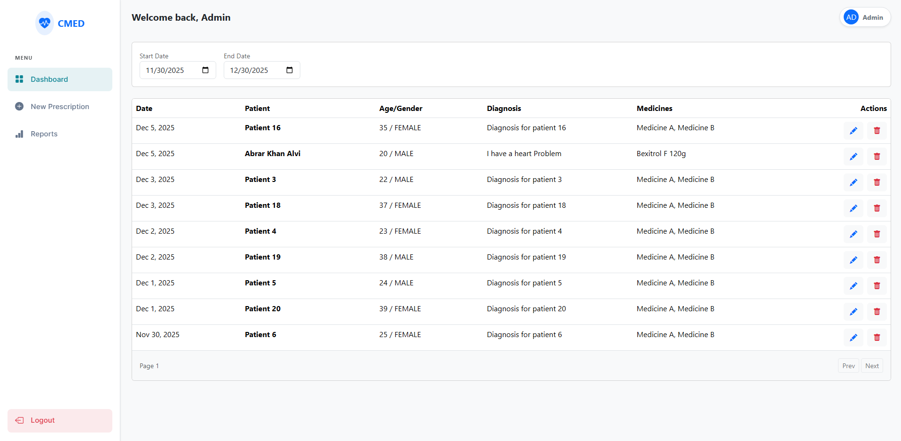
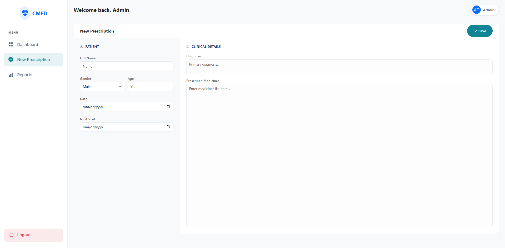
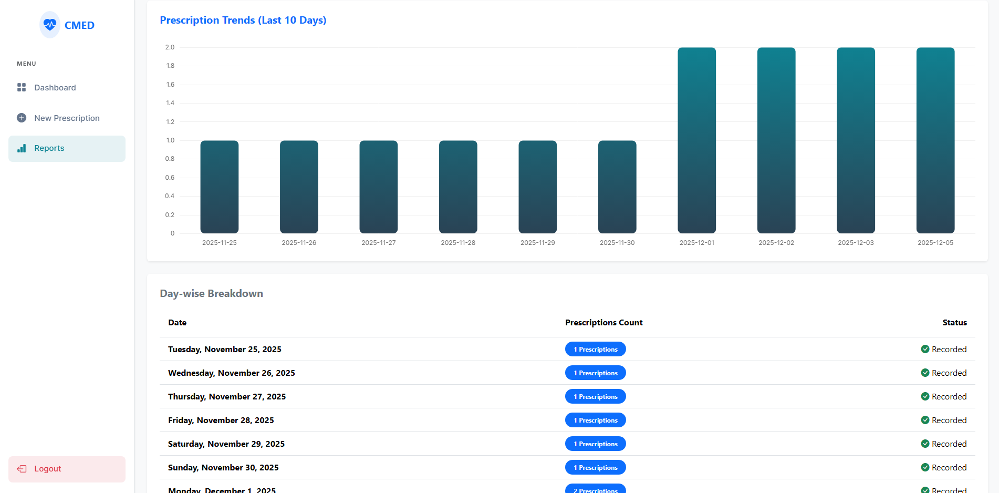

# Prescription Management System

A full-stack application for managing patient prescriptions, generating reports, and tracking daily prescription statistics. Built with **Spring Boot** and **Angular**.

## 🚀 Features

### Functional Requirements
- **Secure Authentication**: No anonymous access. Users must log in (H2/SQLite backed).
- **Dashboard**:
  - View list of prescriptions with pagination.
  - Filter prescriptions by date range (defaults to current month).
- **Prescription Management**:
  - **Create**: Add new prescriptions with validation (Date, Patient Name, Age, Gender, Diagnosis, Medicines).
  - **Edit**: Modify existing prescriptions.
  - **Delete**: Remove prescriptions with confirmation modal.
- **Reporting**:
  - **Day-wise Count**: Column chart showing prescription counts for the last 10 days.
  - **Stats API**: Dedicated endpoint for fetching chart data.
- **Responsive UI**: Modern interface built with Angular & Bootstrap.

### Technical Highlights
- **Backend**: RESTful API, Data Validation, Swagger Documentation, H2 Database.
- **Frontend**: Component-based architecture, Route Guards, Interceptors.

---

## 🛠 Technology Stack

### Backend
- **Java 17**
- **Spring Boot 3.3.0**
- **Spring Security** (Authentication)
- **Spring Data JPA** (Database Access)
- **H2 Database** (In-memory storage)
- **SpringDoc OpenAPI** (Swagger UI)
- **Lombok**

### Frontend
- **Angular 21**
- **Bootstrap 5.3** (Styling)
- **Chart.js & ng2-charts** (Data Visualization)

---

## ⚙️ Setup & Installation

### Prerequisites
- JDK 17+
- Node.js & npm
- Maven (optional, wrapper included)

### 1. Backend Setup (`prescription-system`)
Navigate to the backend directory and run the Spring Boot application:

```bash
cd prescription-system
./mvnw spring-boot:run
```

- The server will start on `http://localhost:8080`.
- **H2 Console**: `http://localhost:8080/h2-console`
- **Swagger UI**: `http://localhost:8080/swagger-ui.html`

### 2. Frontend Setup (`frontend`)
Navigate to the frontend directory, install dependencies, and start the development server:

```bash
cd frontend
npm install
ng serve
```

- Access the application at `http://localhost:4200`.

---

## 📖 API Documentation

The backend exposes a REST API at `/api/v1/prescription`.

| Method | Endpoint | Description |
| :--- | :--- | :--- |
| **GET** | `/api/v1/prescription` | Get paginated list of prescriptions. Supports `page`, `size`, `startDate`, `endDate`. |
| **POST** | `/api/v1/prescription` | Create a new prescription. |
| **PUT** | `/api/v1/prescription/{id}` | Update an existing prescription. |
| **DELETE** | `/api/v1/prescription/{id}` | Delete a prescription. |
| **GET** | `/api/v1/prescription/stats` | Get day-wise prescription counts for charts. |

---

## 📸 Screenshots

### 1. Dashboard
View list of prescriptions with date filters.


### 2. Prescription Form
Form for creating and editing prescriptions.


### 3. Reports
Visualization of daily prescription statistics.


### 4. API Documentation (Swagger)
Interactive API documentation.


